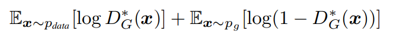

# GANs
本仓库是针对生成对抗网络领域的集合。仓库中的GAN使用Python语言，前端深度学习框架使用Keras，后端使用Tensorflow。目前GAN领域的论文很多，本仓库主要实现一些有代表性的论文，其中的模型不一定完全相同，但核心思想应该是一致的。仓库中借鉴了一些其他仓库的代码，将在注释中标明。如果有新的GAN或者一些实现GAN的方式，欢迎邮件沟通。
  
## GAN简介
要使用GAN，先要了解GAN能用来干什么的。GAN主要用计算机来生成现实中不存在的的信息，包括文字、图片、视频等等。目前的各种研究论文，就是用GAN的方法生成各种不同的信息。
## 重新理解图片
以图片为例，我们首先要换个角度理解图片。一张包含猫的图片，从计算机的角度讲，就是一个向量空间，这个向量空间的值就是图片的像素值。一张完全是噪声的图片，也是一个向量空间，向量空间的值也是图片上的像素值。这两张图片对于计算机来讲没有任何区别，都是向量空间。但是对于人类视觉来讲，存在巨大差别，一个是能看明白的，另外一个是没有任何信息的噪声。 
区别在哪里？在于这两个向量的么某种概率分布不同。对于包含猫的向量空间，它的空间中的所有变量符合猫的概率分布；对于随机噪声组成的空间，它不符合任何人类所理解的物体的概率分布，所以看不出有用信息。所以，生成一幅图片的问题变成了，生成按某种概率分布的向量，例如，生成一张符合猫的概率分布的向量。
## GAN的原理
重新理解了图片以后，很多人发现生成图片（信息）是一个典型深度学习可以解决的问题：设计一个合理的神经网络（生成器），通过比较生成图片和真实图片（训练样本）的概率分布不同，并通过神经网络将误差反向传播到生成器，不停的修正，最小化差异，使生成器可以生成接近真实概率分布的图片。实际上也存在这种网络，叫做生成匹配网络（Genarate Match Networks）。 
GAN(Generative Adversarial Networks)，实际上也是基于这个思想，只是比较生成图片和真实图片（训练样本）的工作交给了一个新的神经网络--判别器。判别器是一个分类神经网络，它也会被不停的训练和提升，它的工作原理和生成器相反：通过要找到生成图片和真实图片（训练样本）的概率分布不同，并通过神经网络将误差反向传播到判别器，不停的修正，最大化差异，使判别器能判别出生成的图片和真实图片。一个最小化差异，一个最大化差异，两个神经网络进行对抗。最后，生成器能生成以假乱真的图片，直到判别器分辨不出来为止（50%）。 
## 数学表达
Ivan Goodfellow在2014年在[<Generative Adversarial Nets>](https://arxiv.org/pdf/1406.2661v1.pdf)中详细描述了GAN的实现过程，并使用简洁的数学表达式表示对抗生成网络： 

